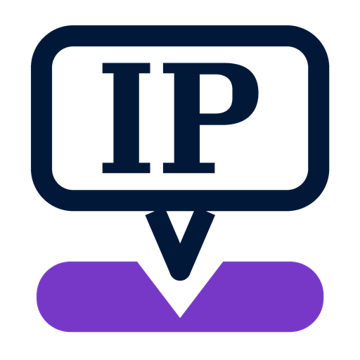

# IP Changer



Modern, letisztult **Windows asztali alkalmazás** (C# / WPF, .NET 8) hálózati
**IP presetek** tárolására és gyors alkalmazására. Egy preset kiválasztása után
egyetlen kattintással átállítja a kiválasztott hálózati adapter IPv4
konfigurációját.

## Funkciók

- 📁 **IP presetek tárolása** – statikus IP, alhálózati maszk, átjáró és DNS, vagy DHCP.
- ✏️ **Szerkeszthető presetek** – létrehozás, módosítás, duplikálás, törlés.
- 📝 **Megjegyzések** – minden presethez szabad szöveges megjegyzés fűzhető.
- 📤 **Import / Export** – presetek JSON fájlba mentése és onnan visszatöltése.
- 🔀 **Adapterválasztás** – az elérhető hálózati adapterek listája, aktuális IP-vel.
- ⚡ **Egy kattintásos alkalmazás** – a `netsh` segítségével állítja be az IP-t.
- 🛡️ **Automatikus rendszergazdai jog** – indításkor UAC-kérés (a manifest miatt),
  mivel az IP módosítása emelt jogot igényel.
- 🎨 **Modern, sötét, letisztult felület** – egyedi WPF téma, külső csomag nélkül.

## Követelmények

- Windows 10 / 11
- [.NET 8 SDK](https://dotnet.microsoft.com/download/dotnet/8.0) (fordításhoz)
- A futtatáshoz rendszergazdai jog szükséges (az alkalmazás automatikusan kéri).

## Fordítás és futtatás

```powershell
# a repó gyökeréből
dotnet build IpChanger.sln -c Release

# futtatás (rendszergazdaként fog UAC-t kérni)
dotnet run --project src/IpChanger/IpChanger.csproj -c Release
```

Önálló, telepítés nélküli (single-file) kiadás készítése:

```powershell
dotnet publish src/IpChanger/IpChanger.csproj -c Release -r win-x64 ^
  --self-contained false -p:PublishSingleFile=true -o publish
```

> Megjegyzés: mivel a projekt `requireAdministrator` szintre van állítva, a
> Visual Studióból való indításkor a Visual Studiót is rendszergazdaként kell
> futtatni, különben a debugger nem tud csatlakozni.

## Használat

1. Indítsd el az alkalmazást, és fogadd el a UAC (rendszergazda) kérést.
2. A **bal oldalon** hozz létre vagy szerkessz presetet (**＋ Új**, **Szerkesztés**).
   - Statikus konfigurációhoz add meg az IP címet, maszkot, opcionálisan az
     átjárót és a DNS-t. DHCP-hez pipáld ki az „IP cím automatikus lekérése” opciót.
   - Bármelyik presethez írhatsz **megjegyzést**.
3. A **jobb oldalon** válaszd ki a módosítani kívánt **hálózati adaptert**.
4. Kattints a **Preset alkalmazása** gombra. Megerősítés után az alkalmazás
   beállítja az adapter IP-jét, majd frissíti a megjelenített aktuális IP-t.
5. Az **Import** / **Export** gombokkal presetek menthetők és megoszthatók (JSON).

## Hogyan tárolódnak a presetek?

A presetek automatikusan mentődnek ide:

```
%AppData%\IpChanger\presets.json
```

Ugyanez a JSON formátum használatos importáláshoz és exportáláshoz is.

## Projektstruktúra

```
IpChanger.sln
src/IpChanger/
├─ app.manifest              # UAC: requireAdministrator
├─ Assets/app.ico            # alkalmazás- és ablakikon (több méret)
├─ App.xaml(.cs)             # belépési pont, függőségek összeállítása
├─ Models/                   # IpPreset, NetworkAdapterInfo, OperationResult
├─ Services/                 # PresetStore, NetworkAdapterService, validáció, dialógusok
├─ ViewModels/               # MVVM: Main- és PresetEditor-ViewModel, RelayCommand
├─ Views/                    # MainWindow, PresetEditorWindow, DialogService
├─ Converters/               # WPF value converterek
└─ Themes/Styles.xaml        # modern sötét téma
```

Az alkalmazás **MVVM** mintát követ: a felhasználói felület (Views) és az
üzleti logika (ViewModels/Services) szét van választva, így a logika a
felülettől függetlenül tesztelhető.

## Az IP módosítás módja

A tényleges beállítást a Windows beépített `netsh` eszközével végzi, például:

```
netsh interface ipv4 set address name="Ethernet" static 192.168.0.10 255.255.255.0 192.168.0.1
netsh interface ipv4 set dnsservers name="Ethernet" static 1.1.1.1 primary
```

DHCP visszaállítás:

```
netsh interface ipv4 set address name="Ethernet" source=dhcp
netsh interface ipv4 set dnsservers name="Ethernet" source=dhcp
```
